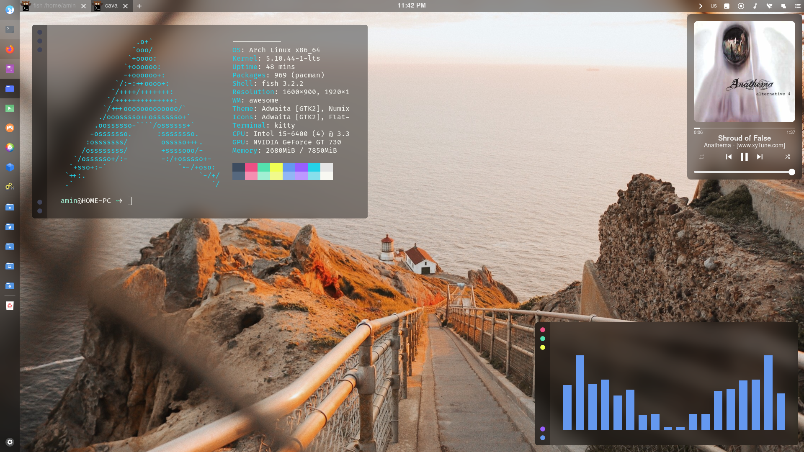

## Awesome Window Manager Config 

این ریپوزیتوری فورک شدس و شاخه فعلی که الآن دارید نگاش می کنید بنابر سلیقه شخصی من ادیت شده خیلی چیزا حذف شده و خیلی چیزا اضافه شده 
مثلا ویجت موزیک اوکی شده میشه بین فارسی و انگلیسی سوییچ کرد و والپیپر به صورت رندوم عوض میشه. 

برا همین باید  ویجت زیر نصب شده باشه 

[wallpaper-changer](https://github.com/zhdanjj/awesome-wallpaper-changer)

برای بقیه چیزا بهتره ریپوزیتوی اصلی چک بشه . اگه همچی اوکی باشه با کپی کردن این ریپو تو مسیر `.config/awesome`  و رفرش کردن ویندوز منیجر با ظاهر جدید مواجه بشبد . 

اسکرین شات : 

